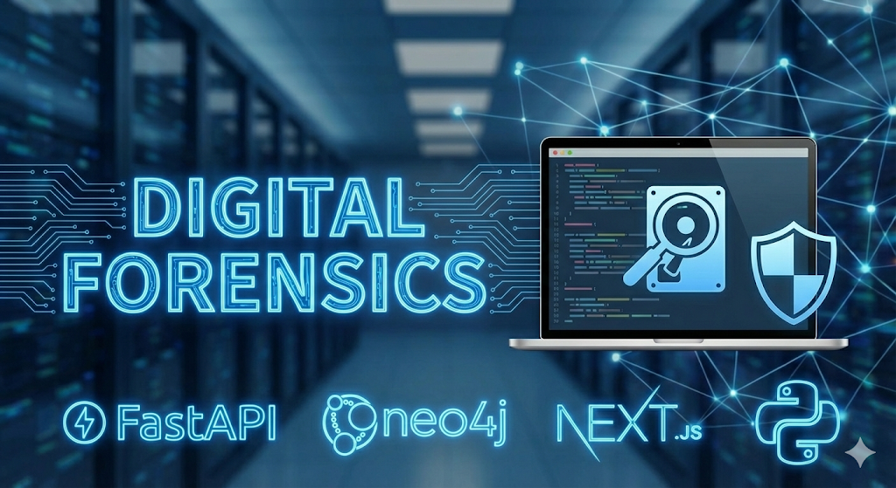

<div align="center">

# 🔍 NexusTrace

### AI-Powered Digital Forensics Intelligence Platform

**Transforming forensic investigations through knowledge graphs, artificial intelligence, and intelligent automation**

[](https://fastapi.tiangolo.com/)
[](https://nextjs.org/)
[](https://reactjs.org/)
[](https://neo4j.com/)
[](https://www.typescriptlang.org/)
[](https://www.python.org/)

[Features](#-key-features) • [Architecture](#-system-architecture) • [Getting Started](#-getting-started) • [Documentation](#-documentation) • [Contributing](#-contributing)

---

</div>

## 📖 Table of Contents

- [What is NexusTrace?](#-what-is-nexustrace)
- [The Problem We Solve](#-the-problem-we-solve)
- [Why Choose NexusTrace?](#-why-choose-nexustrace)
- [Key Features](#-key-features)
- [System Architecture](#-system-architecture)
- [Technology Stack](#-technology-stack)
- [Getting Started](#-getting-started)
- [Project Structure](#-project-structure)
- [Documentation](#-documentation)
- [Use Cases](#-use-cases)
- [Contributing](#-contributing)
- [Roadmap](#-roadmap)
- [License](#-license)
- [Acknowledgments](#-acknowledgments)

---

## 🎯 What is NexusTrace?

**NexusTrace** is a next-generation digital forensics platform that revolutionizes how investigators analyze evidence, uncover connections, and build case narratives. By combining **graph databases**, **artificial intelligence**, and **retrieval-augmented generation (RAG)**, NexusTrace transforms chaotic evidence into actionable intelligence.

### 🌟 Vision

To empower forensic investigators with AI-driven insights and automated analysis, reducing investigation time from weeks to hours while maintaining the highest standards of traceability and explainability.

### 🎭 Core Philosophy

- **Intelligence Over Volume**: Extract meaning from massive evidence repositories
- **Connections Over Isolation**: Visualize relationships that humans might miss
- **Automation Over Manual Labor**: Let AI handle tedious tasks
- **Transparency Over Black Boxes**: Every insight is traceable and explainable

---

## 🔍 The Problem We Solve

### Traditional Forensic Investigation Challenges

<details>
<summary><b>📊 Information Overload</b></summary>

Modern investigations generate **terabytes of evidence**: logs, documents, emails, chat messages, financial records. Manual review is:
- ⏱️ **Time-Consuming**: Weeks or months to analyze a single case
- 💸 **Expensive**: Hundreds of billable hours
- 🎯 **Error-Prone**: Easy to miss critical connections
- 🔄 **Repetitive**: Same analysis patterns across cases
</details>

<details>
<summary><b>🔗 Lost Connections</b></summary>

Evidence exists in silos:
- 📧 Email in one system
- 💾 File access logs in another
- 💰 Financial transactions elsewhere
- **Result**: Investigators miss relationships between entities, events, and evidence
</details>

<details>
<summary><b>📝 Lack of Context</b></summary>

Traditional tools show *what happened* but not *why it matters*:
- No automatic timeline reconstruction
- No entity relationship mapping
- No risk scoring or prioritization
- Investigators waste time on low-value leads
</details>

<details>
<summary><b>🔍 Difficult Knowledge Retrieval</b></summary>

Finding specific information requires:
- Manual keyword searches across thousands of documents
- Reading entire files to extract relevant passages
- Remembering what was found where
- **Result**: Inefficient and frustrating investigation process
</details>

<details>
<summary><b>⚖️ No Audit Trail</b></summary>

Legal proceedings require:
- Transparent methodology
- Traceable analysis steps
- Explainable conclusions
- **Challenge**: Manual processes lack systematic documentation
</details>

---

## ✨ Why Choose NexusTrace?

### 🚀 From Manual to Magical

| Traditional Approach | NexusTrace Approach | Impact |
|---------------------|---------------------|---------|
| 📂 Manual file review | 🤖 **Automatic ingestion & AI triage** | **90% faster** processing |
| 📝 Keyword searches | 🧠 **Semantic search with RAG** | Find relevant info even without exact keywords |
| 🗂️ Spreadsheet tracking | 🕸️ **Knowledge graph visualization** | See connections instantly |
| ⏰ Manual timeline creation | ⚡ **Auto-generated timelines** | From days to seconds |
| 🎯 Gut-feel prioritization | 📊 **AI-powered risk scoring** | Focus on what matters |
| 📑 Scattered notes | 💬 **Natural language Q&A** | Ask questions, get cited answers |
| ❓ Opaque analysis | 🔬 **Explainable AI** | Every answer is traceable |

### 💡 Real-World Benefits

#### ⏱️ **Save Time**
- **Automatic entity extraction**: Identify people, organizations, locations, emails, IPs instantly
- **Smart chunking**: Break down documents intelligently with timestamp detection
- **Parallel processing**: Analyze multiple evidence files simultaneously

#### 🎯 **Improve Accuracy**
- **AI assists, not replaces**: Human oversight on AI-suggested connections
- **Risk-based prioritization**: Focus investigation on highest-risk entities first
- **Pattern detection**: Spot anomalies like failed logins, unusual access, data transfers

#### 📈 **Scale Investigations**
- **Handle massive datasets**: Neo4j graph database scales to millions of nodes
- **Concurrent cases**: Manage multiple investigations with complete isolation
- **Growing knowledge base**: Each case adds to investigative intelligence

#### ⚖️ **Maintain Compliance**
- **Complete audit trail**: Every query, retrieval, and analysis is logged
- **Source attribution**: All answers cite specific evidence chunks
- **Explainable reasoning**: Transparent AI decision-making for court admissibility

#### 🧠 **Augment Expertise**
- **Natural language interface**: Ask questions in plain English
- **Timeline reconstruction**: Chronological event visualization
- **Network analysis**: See who communicated with whom, when
- **Entity analytics**: Understand key players and their connections

---

## 🌟 Key Features

### 🗂️ **Intelligent Evidence Management**
- **Multi-format support**: PDF, TXT, JSON, CSV, and more
- **Automatic parsing**: Extract text and structure from any format
- **Metadata tracking**: Timestamps, file types, upload history
- **Version control**: Track evidence changes and updates

### 🤖 **AI-Powered Analysis**
- **Named Entity Recognition (NER)**: Extract people, organizations, locations, emails, IPs using spaCy
- **Risk Scoring**: Automatic anomaly detection and threat assessment
- **Semantic Embeddings**: Vector-based similarity search with Sentence-Transformers
- **GPT Integration**: OpenAI GPT-4o-mini for intelligent answer generation

### 🕸️ **Knowledge Graph**
- **Neo4j Graph Database**: Store evidence, entities, and relationships
- **Relationship Mapping**: Automatically connect entities across evidence
- **Graph Traversal**: Context-aware retrieval using graph algorithms
- **Visual Exploration**: Interactive graph visualization with React Flow

### 💬 **Retrieval-Augmented Generation (RAG)**
- **Natural Language Q&A**: Ask questions about your case in plain English
- **Hybrid Retrieval**: Combine vector search and graph traversal
- **Cited Answers**: Every response includes source evidence
- **Reasoning Transparency**: See how conclusions were reached

### 📊 **Timeline & Analytics**
- **Auto-Generated Timelines**: Chronological event reconstruction
- **Event Classification**: 17+ event types (Logins, File Access, Emails, etc.)
- **Prioritized Leads**: Risk-ranked entities based on behavior patterns
- **Visual Dashboards**: Real-time case statistics and insights

### 🔐 **Security & Compliance**
- **JWT Authentication**: Secure user sessions
- **Case Isolation**: Complete data separation between investigations
- **Audit Logging**: Track all user actions and queries
- **Role-Based Access**: Control who can access what (planned)

### 🎨 **Modern User Interface**
- **Responsive Design**: Works on desktop, tablet, mobile
- **Dark/Light Themes**: Customizable appearance
- **Interactive Visualizations**: Network graphs, mind maps, timelines
- **Real-Time Updates**: Live feedback on analysis progress

---

## 🏗️ System Architecture

```
┌─────────────────────────────────────────────────────────────────────┐
│                         NexusTrace Platform                         │
├────────────────────────────┬────────────────────────────────────────┤
│                            │                                        │
│   🎨 Frontend (Next.js)    │      🔧 Backend (FastAPI)              │   
│                            │                                        │
│  ┌──────────────────────┐  │  ┌──────────────────────────────────┐  │
│  │  React 19 + TS       │  │  │   RESTful API Endpoints          │  │
│  │  Tailwind CSS        │  │  │   - Authentication               │  │
│  │  shadcn/ui           │  │  │   - Cases                        │  │
│  └──────────────────────┘  │  │   - Evidence Ingestion           │  │
│                            │  │   - RAG Q&A                      │  │
│  ┌──────────────────────┐  │  │   - Graph Analysis               │  │
│  │  State Management    │  │  │   - Feedback                     │  │
│  │  - Zustand Stores    │  │  └──────────────────────────────────┘  │
│  │  - TanStack Query    │  │                                        │
│  └──────────────────────┘  │  ┌──────────────────────────────────┐  │
│                            │  │   AI/ML Pipeline                 │  │ 
│  ┌──────────────────────┐  │  │   - spaCy (NER)                  │  │
│  │  Visualizations      │  │  │   - Sentence-Transformers        │  │
│  │  - React Flow        │  │  │   - OpenAI GPT-4o-mini           │  │
│  │  - Timeline View     │  │  │   - Risk Scoring                 │  │
│  │  - Analytics Charts  │  │  └──────────────────────────────────┘  │
│  └──────────────────────┘  │                                        │
│                            │  ┌──────────────────────────────────┐  │
│                            │  │   Data Processing                │  │
│                            │  │   - File Parsers                 │  │
│                            │  │   - Chunking Engine              │  │
│                            │  │   - Graph Builder                │  │
│                            │  └──────────────────────────────────┘  │
└────────────────────────────┴────────────────────────────────────────┘
                              │
                    ┌─────────┴─────────┐
                    │                   │
            ┌───────▼────────┐  ┌──────▼────────┐
            │  Neo4j Graph   │  │  File Storage │
            │   Database     │  │   (Evidence)  │
            │                │  │               │
            │ - Evidence     │  │ - Uploaded    │
            │ - Chunks       │  │   Files       │
            │ - Entities     │  │ - Logs        │
            │ - Queries      │  │ - Models      │
            └────────────────┘  └───────────────┘
```

### 🔄 Data Flow

1. **Evidence Upload** → File parsed → Text extracted → Chunked
2. **AI Triage** → Entities extracted → Risk scored → Embedded
3. **Graph Storage** → Nodes created → Relationships linked
4. **RAG Query** → Question embedded → Chunks retrieved → Context built → Answer generated
5. **Visualization** → Graph rendered → Timeline displayed → Analytics shown

---

## 🛠️ Technology Stack

### Frontend (Next.js Application)

| Component | Technology | Purpose |
|-----------|-----------|---------|
| **Framework** | Next.js 16.1.6 | React framework with SSR/SSG |
| **UI Library** | React 19.2+ | Component-based UI |
| **Language** | TypeScript 5.x | Type-safe development |
| **Styling** | Tailwind CSS 4.x | Utility-first CSS |
| **Components** | shadcn/ui | Beautiful UI primitives |
| **State** | Zustand | Lightweight state management |
| **Data Fetching** | TanStack Query | Server state management |
| **Visualizations** | React Flow | Interactive graph visualization |
| **HTTP Client** | Axios | API communication |

### Backend (FastAPI Application)

| Component | Technology | Purpose |
|-----------|-----------|---------|
| **Framework** | FastAPI | High-performance async API |
| **Database** | Neo4j 5.x | Graph database |
| **NLP** | spaCy | Named Entity Recognition |
| **Embeddings** | Sentence-Transformers | Semantic similarity |
| **LLM** | OpenAI GPT-4o-mini | Answer generation |
| **Auth** | python-jose, passlib | JWT & password hashing |
| **File Processing** | PyPDF, python-multipart | Multi-format support |
| **Config** | pydantic-settings | Settings management |

### Infrastructure

- **Containerization**: Docker (planned)
- **Version Control**: Git
- **API Documentation**: OpenAPI/Swagger
- **Logging**: Python logging, Winston (frontend)

---

## 🚀 Getting Started

### Prerequisites

Before you begin, ensure you have:
- **Node.js** 18.x or higher
- **Python** 3.9 or higher
- **Neo4j** 5.x (Community or Desktop)
- **OpenAI API Key**
- **Git**

### Quick Start

```bash
# 1. Clone the repository
git clone https://github.com/yourusername/nexustrace.git
cd nexustrace

# 2. Set up Backend
cd nexustrace-backend
python -m venv venv
source venv/bin/activate  # On Windows: venv\Scripts\activate
pip install -r requirements.txt
python -m spacy download en_core_web_sm

# Create .env file with your credentials
# See nexustrace-backend/README.md for details

# Start backend
uvicorn app.main:app --reload

# 3. Set up Frontend (in a new terminal)
cd nexustrace-frontend
npm install

# Create .env.local file
# See nexustrace-frontend/README.md for details

# Start frontend
npm run dev
```

### Access the Platform

- **Frontend**: http://localhost:3000
- **Backend API**: http://localhost:8000
- **API Docs**: http://localhost:8000/docs
- **Neo4j Browser**: http://localhost:7474

---

## 📁 Project Structure

```
nexustrace/
│
├── nexustrace-frontend/          # Next.js Frontend Application
│   ├── app/                      # Next.js app router pages
│   ├── components/               # React components
│   ├── hooks/                    # Custom React hooks
│   ├── lib/                      # Utility functions
│   ├── store/                    # Zustand state stores
│   ├── types/                    # TypeScript definitions
│   └── README.md                 # Frontend documentation
│
├── nexustrace-backend/           # FastAPI Backend Application
│   ├── app/
│   │   ├── auth/                 # Authentication module
│   │   ├── cases/                # Case management
│   │   ├── ingestion/            # Evidence processing
│   │   ├── ai/                   # NLP & embeddings
│   │   ├── graph/                # Knowledge graph
│   │   ├── rag/                  # RAG system
│   │   ├── feedback/             # User feedback
│   │   ├── core/                 # Config & security
│   │   └── db/                   # Database handlers
│   └── README.md                 # Backend documentation
│
└── README.md                     # This file
```

---

## 📚 Documentation

### For Contributors

| Document | Description |
|----------|-------------|
| [**Frontend README**](nexustrace-frontend/README.md) | Complete frontend setup, architecture, and contribution guide |
| [**Backend README**](nexustrace-backend/README.md) | Complete backend setup, API docs, and development guide |
| [**Frontend Quick Setup**](nexustrace-frontend/QUICK_SETUP.md) | Get frontend running in 5 minutes |
| [**API Integration**](nexustrace-frontend/API_INTEGRATION.md) | How frontend communicates with backend |
| [**Contributing Guide**](nexustrace-frontend/CONTRIBUTING.md) | Contribution workflow and standards |

### For Users

- **API Documentation**: Visit http://localhost:8000/docs for interactive API docs
- **Timeline Implementation**: See [TIMELINE_IMPLEMENTATION.md](nexustrace-backend/TIMELINE_IMPLEMENTATION.md)
- **Project Structure**: See [PROJECT_STRUCTURE.md](nexustrace-frontend/PROJECT_STRUCTURE.md)

---

## 🎯 Use Cases

### 🔐 Cybersecurity Incident Response
**Scenario**: Data breach investigation with thousands of access logs

**How NexusTrace Helps**:
- Automatically extract IPs, usernames, timestamps
- Build timeline of unauthorized access
- Identify compromised accounts via pattern analysis
- Generate network graph of lateral movement

### 💼 Corporate Fraud Investigation
**Scenario**: Financial irregularities across emails, transactions, and documents

**How NexusTrace Helps**:
- Extract entities (people, companies, amounts)
- Connect emails to transactions to contracts
- Timeline of events leading to suspicious transfers
- RAG queries: "Who authorized payments to offshore accounts?"

### ⚖️ Legal Discovery
**Scenario**: eDiscovery in litigation with millions of documents

**How NexusTrace Helps**:
- Semantic search across entire document corpus
- Find relevant evidence without exact keyword matches
- Entity relationship graphs for key players
- Explainable citations for court submissions

### 🔍 Law Enforcement
**Scenario**: Digital forensics on seized devices

**How NexusTrace Helps**:
- Process chat logs, emails, browsing history
- Build social network of suspects
- Timeline reconstruction of criminal activities
- Risk-score entities by suspicious behavior

### 🛡️ Compliance Auditing
**Scenario**: Review access logs for regulatory compliance

**How NexusTrace Helps**:
- Detect unauthorized data access
- Track privileged user activities
- Generate audit-ready reports with full traceability
- Alert on anomalous patterns

---

## 🤝 Contributing

We welcome contributions from the community! NexusTrace is built by investigators, for investigators.

### How to Contribute

1. **🐛 Report Bugs**: [Open an issue](https://github.com/yourusername/nexustrace/issues)
2. **💡 Suggest Features**: Share your ideas
3. **📝 Improve Docs**: Help us document better
4. **💻 Submit Code**: 
   - Fork the repository
   - Create a feature branch
   - Make your changes
   - Submit a pull request

### Contribution Areas

- **Frontend Development**: React, TypeScript, UI/UX
- **Backend Development**: Python, FastAPI, Neo4j
- **AI/ML**: NLP, embeddings, LLM integration
- **Graph Algorithms**: Neo4j Cypher queries, graph analytics
- **Testing**: Unit tests, integration tests, E2E tests
- **Documentation**: Tutorials, examples, guides
- **Design**: UI/UX improvements, visualizations

See individual README files in [frontend](nexustrace-frontend/README.md) and [backend](nexustrace-backend/README.md) for detailed contribution guidelines.

---

## 🗺️ Roadmap

### ✅ Current Features (v1.0)

- JWT authentication
- Case and evidence management
- Multi-format file ingestion
- AI entity extraction and risk scoring
- Knowledge graph storage
- RAG-powered Q&A
- Timeline generation
- Prioritized leads
- Interactive graph visualization

### 🚧 In Progress (v1.1)

- [ ] Advanced role-based access control
- [ ] Multi-user collaboration
- [ ] Enhanced analytics dashboard
- [ ] Export reports (PDF, DOCX)
- [ ] Email evidence parsing
- [ ] Log file format detection

### 🔮 Future Enhancements (v2.0+)

- [ ] Real-time evidence monitoring
- [ ] Advanced pattern recognition
- [ ] Predictive analytics
- [ ] Integration with SIEM platforms
- [ ] Mobile application
- [ ] Blockchain evidence integrity
- [ ] Multi-language support
- [ ] GPU-accelerated processing
- [ ] Federated learning for privacy
- [ ] Custom AI model fine-tuning

---

## 📄 License

This project is licensed under the **MIT License** - see the [LICENSE](LICENSE) file for details.

---

## 🙏 Acknowledgments

NexusTrace stands on the shoulders of giants:

- **FastAPI Team**: For the incredible Python framework
- **Vercel Team**: For Next.js and modern React patterns
- **Neo4j**: For the powerful graph database
- **OpenAI**: For GPT models that power RAG
- **spaCy Team**: For industrial-strength NLP
- **Sentence-Transformers**: For efficient embeddings
- **shadcn**: For beautiful, accessible UI components
- **Open Source Community**: For countless libraries and tools

### Special Thanks

- Digital forensics community for feedback and feature requests
- Early adopters and beta testers
- All contributors who help make NexusTrace better

---

## 📞 Contact & Support

- **GitHub**: [@reyandabreo](https://github.com/reyandabreo/nexustrace)
- **Issues**: [Report bugs or request features](https://github.com/yourusername/nexustrace/issues)
- **Discussions**: [Join the conversation](https://github.com/yourusername/nexustrace/discussions)
- **Email**: rayepenber28@gmail.com

---

<div align="center">

### 🌟 Star us on GitHub — it helps!

**Built with ❤️ by the forensic investigation community**

**NexusTrace** • Turning Evidence into Intelligence

[⬆ Back to Top](#-nexustrace)

</div>
