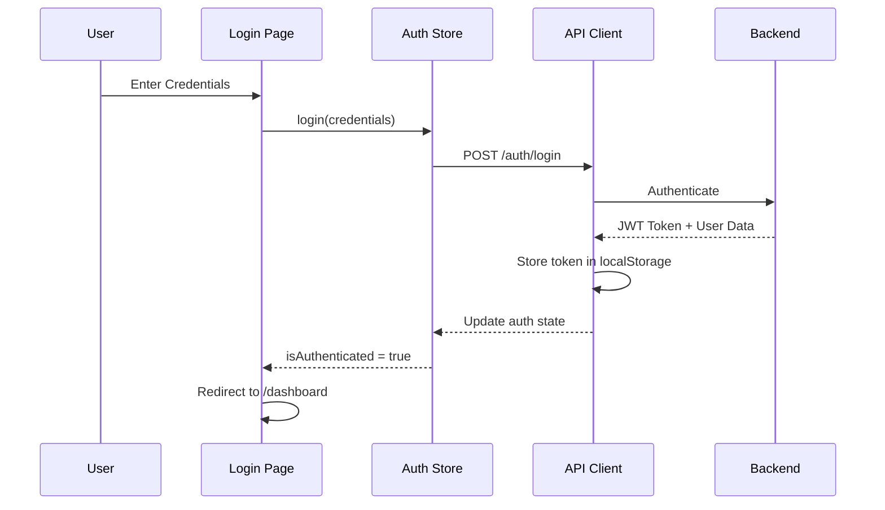
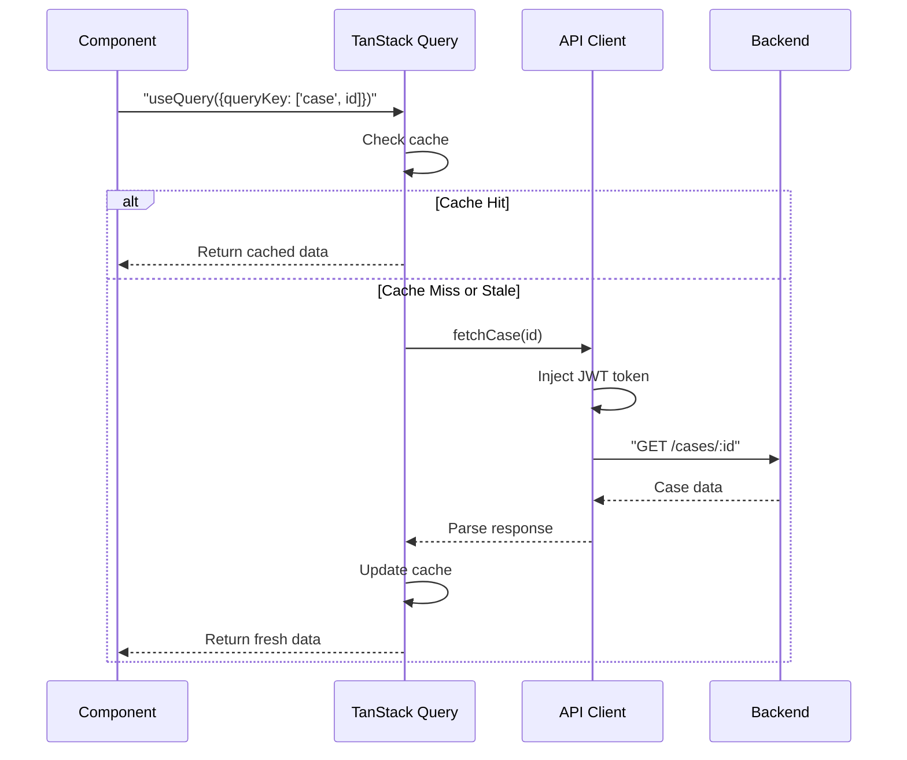
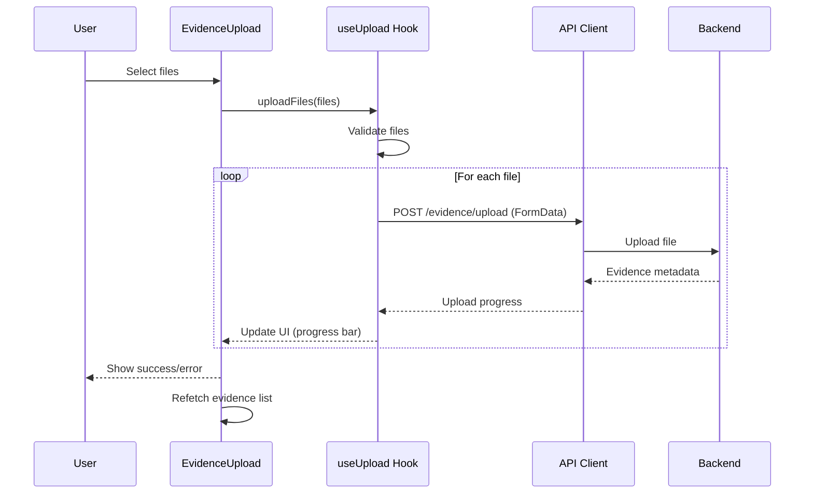

# NexusTrace Frontend - Project Structure

> 📖 [← Back to Main README](README.md) | [Quick Setup](QUICK_SETUP.md) | [API Integration](API_INTEGRATION.md) | [Contributing](CONTRIBUTING.md)

This document provides an in-depth overview of the NexusTrace frontend architecture, file organization, and design patterns.

## 📋 Table of Contents

- [Architecture Overview](#️-architecture-overview)
- [Directory Structure](#-directory-structure)
- [Routing Strategy](#️-routing-strategy)
- [State Management](#️-state-management)
- [Data Flow](#-data-flow)
- [Component Hierarchy](#-component-hierarchy)
- [Type System](#-type-system)
- [Design Patterns](#-design-patterns)
- [Utility Functions](#-utility-functions)
- [Module System](#-module-system)
- [Performance Optimizations](#-performance-optimizations)
- [Summary](#-summary)

---

## 🏗️ Architecture Overview

NexusTrace follows a modern, scalable architecture using Next.js App Router with TypeScript.

### High-Level Architecture

```
┌─────────────────────────────────────────────────────────────┐
│                     Browser (Client)                         │
│  ┌────────────────────────────────────────────────────────┐ │
│  │              Next.js App (React 19)                     │ │
│  │  ┌──────────────────────────────────────────────────┐  │ │
│  │  │  UI Components (Shadcn + Custom)                  │  │ │
│  │  └──────────────────────────────────────────────────┘  │ │
│  │  ┌──────────────┐  ┌──────────────┐  ┌─────────────┐  │ │
│  │  │   Zustand    │  │ TanStack     │  │   Custom    │  │ │
│  │  │   Stores     │  │   Query      │  │   Hooks     │  │ │
│  │  └──────────────┘  └──────────────┘  └─────────────┘  │ │
│  │  ┌──────────────────────────────────────────────────┐  │ │
│  │  │         Axios Client (API Layer)                  │  │ │
│  │  │  - JWT Authentication                            │  │ │
│  │  │  - Request/Response Interceptors                 │  │ │
│  │  └──────────────────────────────────────────────────┘  │ │
│  └────────────────────────────────────────────────────────┘ │
└─────────────────────────────────────────────────────────────┘
                            │
                            │ HTTP/REST
                            ▼
┌─────────────────────────────────────────────────────────────┐
│              FastAPI Backend (:8000)                         │
│        - Authentication (JWT)                                │
│        - Case Management                                     │
│        - Evidence Processing                                 │
│        - RAG Engine                                          │
│        - Entity Extraction                                   │
└─────────────────────────────────────────────────────────────┘
```

### Technology Layers

```
┌────────────────────────────────────────┐
│         Presentation Layer              │
│  - React Components                     │
│  - Tailwind CSS Styling                 │
│  - Client-Side Routing                  │
└────────────────────────────────────────┘
              │
┌────────────────────────────────────────┐
│        State Management Layer           │
│  - Zustand (Local State)                │
│  - TanStack Query (Server State)        │
│  - React Context (Theme, Auth)          │
└────────────────────────────────────────┘
              │
┌────────────────────────────────────────┐
│         Data Access Layer               │
│  - Axios HTTP Client                    │
│  - API Service Functions                │
│  - Request/Response Interceptors        │
└────────────────────────────────────────┘
              │
┌────────────────────────────────────────┐
│          Backend API Layer              │
│  - RESTful Endpoints                    │
│  - JWT Authentication                   │
│  - Database Operations                  │
└────────────────────────────────────────┘
```

---

## 📁 Directory Structure

### Root Level

```
nexustrace-frontend/
├── app/                  # Next.js App Router (Routes & Pages)
├── components/           # Reusable React Components
├── hooks/               # Custom React Hooks
├── lib/                 # Utility Libraries & Helpers
├── store/               # Zustand State Stores
├── types/               # TypeScript Type Definitions
├── public/              # Static Assets (Images, Fonts, etc.)
├── .env.local           # Environment Variables (gitignored)
├── .env.example         # Environment Variable Template
├── next.config.ts       # Next.js Configuration
├── tailwind.config.ts   # Tailwind CSS Configuration
├── tsconfig.json        # TypeScript Configuration
├── package.json         # Dependencies & Scripts
└── proxy.ts             # Middleware for Auth & Routing
```

### App Directory (Routing)

```
app/
├── layout.tsx                    # Root Layout (Global)
├── page.tsx                      # Landing Page (/)
├── globals.css                   # Global Styles
│
├── login/
│   └── page.tsx                  # Login Page (/login)
│
├── register/
│   └── page.tsx                  # Registration (/register)
│
└── dashboard/
    ├── layout.tsx                # Dashboard Layout
    ├── page.tsx                  # Dashboard Home (/dashboard)
    │
    ├── cases/
    │   └── page.tsx              # Cases List (/dashboard/cases)
    │
    ├── case/
    │   └── [caseId]/
    │       ├── layout.tsx        # Case Layout (Sidebar)
    │       ├── page.tsx          # Case Overview
    │       ├── entities/
    │       │   └── page.tsx      # Entity Extraction View
    │       ├── timeline/
    │       │   └── page.tsx      # Timeline View
    │       ├── network/
    │       │   └── page.tsx      # Network Graph
    │       ├── mindmap/
    │       │   └── page.tsx      # Mind Map
    │       ├── rag/
    │       │   └── page.tsx      # RAG Chat Interface
    │       └── prioritized/
    │           └── page.tsx      # Prioritized Evidence
    │
    ├── analytics/
    │   └── page.tsx              # Analytics Dashboard
    │
    ├── activity/
    │   └── page.tsx              # Activity Feed
    │
    ├── audit/
    │   └── page.tsx              # Audit Logs
    │
    └── settings/
        └── page.tsx              # Settings
```

### Components Directory

```
components/
├── ui/                          # Shadcn UI Base Components
│   ├── button.tsx
│   ├── card.tsx
│   ├── dialog.tsx
│   ├── input.tsx
│   ├── table.tsx
│   ├── tabs.tsx
│   └── ...
│
├── layout/                      # Layout Components
│   ├── TopNavbar.tsx           # Global Navigation Bar
│   ├── DashboardSidebar.tsx    # Dashboard Sidebar
│   ├── CaseSidebar.tsx         # Case-Specific Sidebar
│   ├── GlobalSearch.tsx        # Search Component
│   └── NotificationsDrawer.tsx # Notifications Panel
│
├── evidence/                    # Evidence Components
│   ├── EvidenceList.tsx        # Evidence List View
│   └── EvidenceUpload.tsx      # Upload Interface
│
├── rag/                         # RAG Chat Components
│   ├── ChatMessage.tsx         # Individual Message
│   └── ExplanationDrawer.tsx   # AI Explanation Panel
│
└── providers.tsx                # Context Providers Wrapper
```

### Hooks Directory

```
hooks/
├── useAuth.ts         # Authentication Hook
├── useCases.ts        # Case Management Hook
├── useRag.ts          # RAG Chat Hook
└── useUpload.ts       # File Upload Hook
```

**Purpose**: Custom React hooks for reusable logic across components.

### Library Directory

```
lib/
├── api.ts             # Axios Instance & Interceptors
├── queryClient.ts     # TanStack Query Configuration
├── caseUtils.ts       # Case-Specific Utilities
└── utils.ts           # General Utility Functions
```

**Key Functions**:
- `api.ts`: Centralized HTTP client with auth token injection
- `queryClient.ts`: Query caching and retry configuration
- `utils.ts`: `cn()` for class name merging, formatters, validators

### Store Directory

```
store/
├── authStore.ts       # Authentication State
├── caseStore.ts       # Case State
├── activityStore.ts   # Activity Feed State
└── auditStore.ts      # Audit Log State
```

**Pattern**: Zustand stores following this structure:
```typescript
interface Store {
  // State
  data: Type;
  loading: boolean;
  error: string | null;
  
  // Actions
  fetchData: () => Promise<void>;
  updateData: (data: Type) => void;
  reset: () => void;
}
```

### Types Directory

```
types/
├── auth.ts            # Authentication Types
├── case.ts            # Case & Evidence Types
├── graph.ts           # Graph/Network Types
├── rag.ts             # RAG Chat Types
└── xyflow-react.d.ts  # XYFlow Type Augmentation
```

---

## 🛤️ Routing Strategy

### Next.js App Router

NexusTrace uses the **App Router** (introduced in Next.js 13+) for file-based routing.

#### Route Structure

| URL Path | File Path | Description |
|----------|-----------|-------------|
| `/` | `app/page.tsx` | Landing page |
| `/login` | `app/login/page.tsx` | Login page |
| `/register` | `app/register/page.tsx` | Registration |
| `/dashboard` | `app/dashboard/page.tsx` | Dashboard home |
| `/dashboard/cases` | `app/dashboard/cases/page.tsx` | Cases list |
| `/dashboard/case/[id]` | `app/dashboard/case/[caseId]/page.tsx` | Case view |
| `/dashboard/case/[id]/timeline` | `app/dashboard/case/[caseId]/timeline/page.tsx` | Timeline |

#### Dynamic Routes

```typescript
// app/dashboard/case/[caseId]/page.tsx
interface PageProps {
  params: Promise<{
    caseId: string;
  }>;
}

export default async function CasePage({ params }: PageProps) {
  const { caseId } = await params;
  // Fetch and display case data
}
```

#### Layouts

```
app/
├── layout.tsx              # Global layout (wraps all pages)
└── dashboard/
    ├── layout.tsx          # Dashboard layout (sidebar + navbar)
    └── case/[caseId]/
        └── layout.tsx      # Case layout (case-specific sidebar)
```

**Layout Nesting**:
```
Global Layout
  └── Dashboard Layout
      └── Case Layout
          └── Page Content
```

### Protected Routes

Middleware in `proxy.ts` protects dashboard routes:

```typescript
export default function proxy(request: NextRequest) {
  const { pathname } = request.nextUrl;
  
  // Public routes
  const publicPaths = ["/", "/login", "/register"];
  
  // Check authentication
  const token = request.cookies.get("nexustrace-auth")?.value;
  
  if (!isPublic && !token) {
    return NextResponse.redirect(new URL("/login", request.url));
  }
  
  return NextResponse.next();
}
```

---

## 🗃️ State Management

### State Management Strategy

```
┌─────────────────────────────────────────────────────────┐
│                    Application State                     │
├─────────────────────────────────────────────────────────┤
│                                                          │
│  ┌──────────────────┐  ┌──────────────────┐            │
│  │   Server State   │  │   Client State   │            │
│  │                  │  │                  │            │
│  │  TanStack Query  │  │     Zustand      │            │
│  │                  │  │                  │            │
│  │  - Cases         │  │  - UI State      │            │
│  │  - Evidence      │  │  - User Prefs    │            │
│  │  - Users         │  │  - Temp Data     │            │
│  └──────────────────┘  └──────────────────┘            │
│                                                          │
│  ┌──────────────────────────────────────────┐            │
│  │           React Context                  │            │
│  │  - Theme (Dark/Light)                    │            │
│  │  - Auth Provider                         │            │
│  └──────────────────────────────────────────┘            │
└─────────────────────────────────────────────────────────┘
```

### Zustand Stores

**Auth Store** (`store/authStore.ts`):
```typescript
interface AuthStore {
  user: User | null;
  isAuthenticated: boolean;
  login: (credentials: LoginData) => Promise<void>;
  logout: () => void;
}
```

**Case Store** (`store/caseStore.ts`):
```typescript
interface CaseStore {
  currentCase: Case | null;
  setCurrentCase: (case: Case) => void;
  clearCurrentCase: () => void;
}
```

### TanStack Query

Used for server state (data fetching, caching, synchronization):

```typescript
// In a component or hook
const { data, isLoading, error } = useQuery({
  queryKey: ["cases", caseId],
  queryFn: () => api.get(`/cases/${caseId}`).then(res => res.data),
  staleTime: 5 * 60 * 1000, // 5 minutes
});
```

**Benefits**:
- Automatic caching
- Background refetching
- Optimistic updates
- Request deduplication

---

## 🔄 Data Flow

### Authentication Flow



### Case Data Fetching Flow



### Evidence Upload Flow



---

## 🧩 Component Hierarchy

### Dashboard Layout Hierarchy

```
app/dashboard/layout.tsx
├── <DashboardSidebar />
├── <TopNavbar />
│   ├── <GlobalSearch />
│   └── <NotificationsDrawer />
└── {children}
```

### Case Page Hierarchy

```
app/dashboard/case/[caseId]/layout.tsx
├── <CaseSidebar />
│   ├── Case Info
│   ├── Evidence List
│   └── Navigation Links
└── {children} (timeline, network, entities, etc.)
```

### Example Component Tree

```
CasePage
├── CaseHeader
│   ├── Title
│   ├── StatusBadge
│   └── ActionButtons
├── Tabs
│   ├── TabsList
│   │   ├── TimelineTab
│   │   ├── NetworkTab
│   │   └── EntitiesTab
│   └── TabsContent
│       └── TimelineView
│           ├── TimelineFilters
│           ├── TimelineChart
│           └── TimelineEvents
│               └── EventCard (multiple)
└── CaseSidebar
    └── EvidenceList
        └── EvidenceItem (multiple)
```

---

## 📘 Type System

### Type Organization

```
types/
├── auth.ts       # User, LoginRequest, RegisterRequest, AuthResponse
├── case.ts       # Case, Evidence, TimelineEvent, CreateCaseRequest
├── graph.ts      # Node, Edge, GraphData
└── rag.ts        # Message, RagRequest, RagResponse
```

### Example Type Definitions

```typescript
// types/case.ts
export interface Case {
  id: string;
  case_id: string;
  title: string;
  description: string;
  status: "open" | "closed" | "in_progress";
  created_at: string;
  updated_at: string;
  owner_id: string;
  evidence_count: number;
}

export interface Evidence {
  evidence_id: string;
  filename: string;
  file_type: string;
  created_at: string;
}

export interface TimelineEvent {
  id: string;
  timestamp: string;
  event_type: string;
  description: string;
  metadata?: Record<string, unknown>;
}
```

### Type Safety Benefits

- **Autocomplete**: IDE suggestions for properties and methods
- **Error Detection**: Catch type errors at compile time
- **Refactoring**: Safe renaming and restructuring
- **Documentation**: Types serve as inline documentation

---

## 🎨 Design Patterns

### 1. Container/Presentational Pattern

**Container** (Smart Component):
```typescript
// containers/CaseListContainer.tsx
export function CaseListContainer() {
  const { data: cases, isLoading } = useCases();
  
  if (isLoading) return <Skeleton />;
  
  return <CaseList cases={cases} />;
}
```

**Presentational** (Dumb Component):
```typescript
// components/CaseList.tsx
interface CaseListProps {
  cases: Case[];
}

export function CaseList({ cases }: CaseListProps) {
  return (
    <div>
      {cases.map(case => <CaseCard key={case.id} case={case} />)}
    </div>
  );
}
```

### 2. Custom Hooks Pattern

```typescript
// hooks/useCases.ts
export function useCases() {
  return useQuery({
    queryKey: ["cases"],
    queryFn: async () => {
      const response = await api.get("/cases");
      return response.data;
    },
  });
}

// Usage in component
function CasesPage() {
  const { data: cases, isLoading, error } = useCases();
  // ...
}
```

### 3. Compound Components Pattern

```typescript
export function Tabs({ children }) {
  return <div className="tabs">{children}</div>;
}

Tabs.List = function TabsList({ children }) {
  return <div className="tabs-list">{children}</div>;
};

Tabs.Content = function TabsContent({ children }) {
  return <div className="tabs-content">{children}</div>;
};

// Usage
<Tabs>
  <Tabs.List>
    <TabItem>Timeline</TabItem>
    <TabItem>Network</TabItem>
  </Tabs.List>
  <Tabs.Content>
    <TimelineView />
  </Tabs.Content>
</Tabs>
```

### 4. Render Props Pattern

```typescript
interface DataFetcherProps {
  url: string;
  children: (data: any, loading: boolean) => React.ReactNode;
}

function DataFetcher({ url, children }: DataFetcherProps) {
  const { data, isLoading } = useQuery({ queryKey: [url], queryFn: () => fetch(url) });
  return <>{children(data, isLoading)}</>;
}

// Usage
<DataFetcher url="/api/cases">
  {(data, loading) => loading ? <Spinner /> : <CaseList cases={data} />}
</DataFetcher>
```

---

## 🔧 Utility Functions

### Class Name Merging

```typescript
// lib/utils.ts
import { clsx, type ClassValue } from "clsx";
import { twMerge } from "tailwind-merge";

export function cn(...inputs: ClassValue[]) {
  return twMerge(clsx(inputs));
}

// Usage
<div className={cn(
  "base-class",
  isActive && "active-class",
  variant === "primary" ? "primary" : "secondary"
)} />
```

### Date Formatting

```typescript
export function formatDate(date: string | number): string {
  return new Date(date).toLocaleDateString("en-US", {
    year: "numeric",
    month: "long",
    day: "numeric",
  });
}
```

---

## 📦 Module System

### Import Aliases

Configured in `tsconfig.json`:

```json
{
  "compilerOptions": {
    "baseUrl": ".",
    "paths": {
      "@/*": ["./*"]
    }
  }
}
```

**Usage**:
```typescript
// Instead of: import { Button } from "../../components/ui/button"
import { Button } from "@/components/ui/button";
```

---

## 🚀 Performance Optimizations

1. **Code Splitting**: Automatic route-based splitting by Next.js
2. **Lazy Loading**: Dynamic imports for heavy components
3. **Memoization**: `React.memo()` for expensive renders
4. **Query Caching**: TanStack Query automatic caching
5. **Image Optimization**: Next.js `<Image>` component

---

## 📝 Summary

This structure provides:
- **Scalability**: Easy to add new features
- **Maintainability**: Clear separation of concerns
- **Type Safety**: Full TypeScript coverage
- **Developer Experience**: Modern tooling and patterns
- **Performance**: Optimized for production

For more details on specific implementations, refer to the code comments and inline documentation.

---

## 📚 Related Documentation

- [Main README](README.md) - Project overview and getting started
- [Quick Setup Guide](QUICK_SETUP.md) - Fast setup instructions
- [Quick Reference](QUICK_REFERENCE.md) - Commands and patterns
- [Contributing Guide](CONTRIBUTING.md) - Contribution guidelines
- [API Integration](API_INTEGRATION.md) - API documentation
- [Changelog](CHANGELOG.md) - Version history

---

**Last Updated**: February 2026
