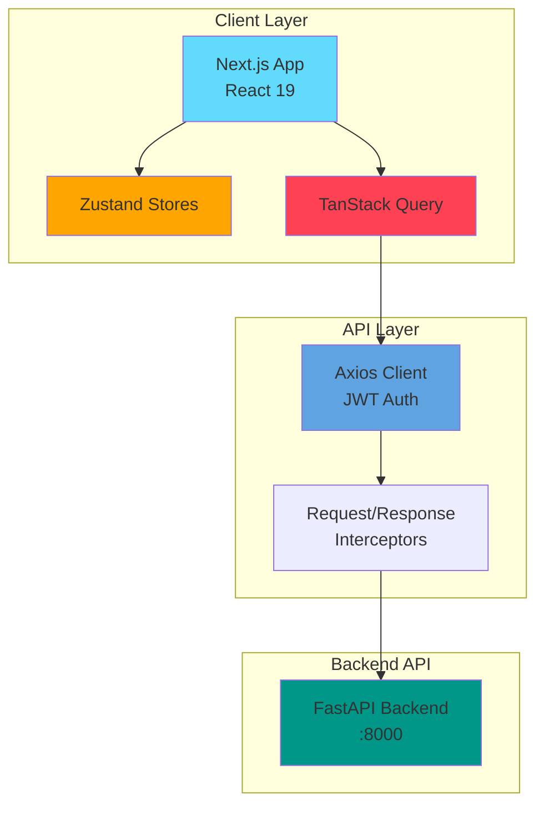
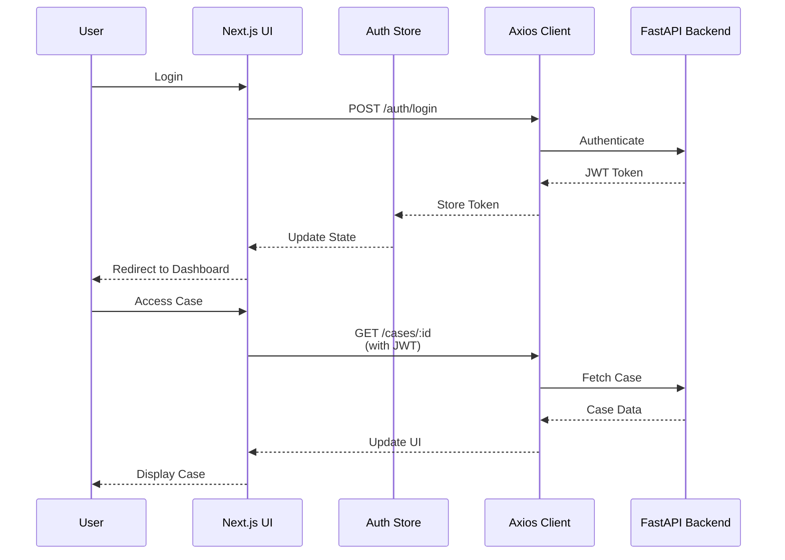

# NexusTrace Frontend 🔍

<div align="center">

**A Modern Digital Forensics Investigation Platform**

[](https://nextjs.org/)
[](https://reactjs.org/)
[](https://www.typescriptlang.org/)
[](https://tailwindcss.com/)

</div>

---

## 📋 Table of Contents

- [Overview](#overview)
- [Features](#features)
- [Tech Stack](#tech-stack)
- [Architecture](#architecture)
- [Project Structure](#project-structure)
- [Prerequisites](#prerequisites)
- [Getting Started](#getting-started)
- [Environment Variables](#environment-variables)
- [Development Workflow](#development-workflow)
- [Contributing](#contributing)
- [Code Style Guidelines](#code-style-guidelines)
- [Available Scripts](#available-scripts)
- [Troubleshooting](#troubleshooting)

---

## 🎯 Overview

**NexusTrace** is a comprehensive digital forensics investigation platform designed to streamline the process of managing cases, analyzing evidence, and visualizing complex relationships in investigative data. Built with modern web technologies, it provides investigators with powerful tools for evidence management, timeline reconstruction, network analysis, and AI-powered insights.

### Key Capabilities

- **Case Management**: Create and manage multiple investigation cases with detailed metadata
- **Evidence Handling**: Upload, organize, and track digital evidence
- **Visual Analytics**: Interactive network graphs, mind maps, and timeline visualizations
- **AI-Powered RAG**: Chat interface with Retrieval Augmented Generation for intelligent evidence querying
- **Entity Extraction**: Automatic identification and visualization of entities from evidence
- **Audit Trail**: Comprehensive logging of all investigative actions
- **Analytics Dashboard**: Real-time insights and statistics on case progress

---

## ✨ Features

### 🗂️ Case Management
- Create, update, and close investigation cases
- Track case status (Open, In Progress, Closed)
- Evidence count tracking
- Case metadata management

### 📤 Evidence Upload & Management
- Multi-file upload support
- File type validation
- Automatic metadata extraction
- Evidence timeline tracking

### 🧠 AI-Powered Analysis
- **RAG Chat Interface**: Ask questions about evidence using natural language
- **Entity Extraction**: Automatic identification of people, places, organizations
- **Smart Explanations**: AI-generated insights and explanations

### 📊 Visualizations
- **Timeline View**: Chronological event reconstruction
- **Network Graph**: Relationship mapping using XYFlow
- **Mind Maps**: Visual case structure and connections
- **Analytics Charts**: Statistics and trends using Recharts

### 🔒 Security
- JWT-based authentication
- Protected routes with middleware
- Automatic token refresh
- Audit logging for compliance

### 🎨 Modern UI/UX
- Dark/Light theme support
- Responsive design
- Accessible components (Radix UI)
- Real-time notifications
- Global search functionality

---

## 🛠️ Tech Stack

### Core Framework
- **[Next.js 16](https://nextjs.org/)** - React framework with App Router
- **[React 19](https://react.dev/)** - UI library
- **[TypeScript 5](https://www.typescriptlang.org/)** - Type-safe JavaScript

### Styling & UI
- **[Tailwind CSS 4](https://tailwindcss.com/)** - Utility-first CSS framework
- **[Shadcn UI](https://ui.shadcn.com/)** - Re-usable component library
- **[Radix UI](https://www.radix-ui.com/)** - Accessible component primitives
- **[Lucide React](https://lucide.dev/)** - Icon library

### State Management & Data Fetching
- **[Zustand](https://zustand-demo.pmnd.rs/)** - Lightweight state management
- **[TanStack Query](https://tanstack.com/query/)** - Server state management
- **[Axios](https://axios-http.com/)** - HTTP client

### Forms & Validation
- **[React Hook Form](https://react-hook-form.com/)** - Performant form library
- **[Zod](https://zod.dev/)** - TypeScript-first schema validation

### Visualization
- **[XYFlow (React Flow)](https://reactflow.dev/)** - Network/graph visualization
- **[Recharts](https://recharts.org/)** - Chart library
- **[React Markdown](https://github.com/remarkjs/react-markdown)** - Markdown rendering

### Development Tools
- **[ESLint](https://eslint.org/)** - Code linting
- **[PostCSS](https://postcss.org/)** - CSS processing

---

## 🏗️ Architecture

### System Architecture



### Application Flow



### Component Architecture

```mermaid
graph TD
    subgraph "App Router Structure"
        Root[app/]
        Layout[layout.tsx]
        Page[page.tsx]
        Dashboard[dashboard/]
        Case[case/[caseId]/]
    end
    
    subgraph "Shared Components"
        UI[ui/]
        Layout_C[layout/]
        Evidence[evidence/]
        RAG[rag/]
    end
    
    subgraph "State Management"
        AuthStore[authStore]
        CaseStore[caseStore]
        ActivityStore[activityStore]
        AuditStore[auditStore]
    end
    
    subgraph "Custom Hooks"
        useAuth[useAuth]
        useCases[useCases]
        useRag[useRag]
        useUpload[useUpload]
    end
    
    Root --> Layout
    Root --> Page
    Root --> Dashboard
    Dashboard --> Case
    
    Case --> Evidence
    Case --> RAG
    
    Evidence --> UI
    RAG --> UI
    
    useAuth --> AuthStore
    useCases --> CaseStore
    
    style Root fill:#ffa726
    style AuthStore fill:#66bb6a
    style useAuth fill:#42a5f5
```

---

## 📁 Project Structure

```
nexustrace-frontend/
├── app/                          # Next.js App Router
│   ├── globals.css              # Global styles
│   ├── layout.tsx               # Root layout
│   ├── page.tsx                 # Landing page
│   ├── login/                   # Authentication
│   ├── register/                # User registration
│   └── dashboard/               # Protected dashboard
│       ├── page.tsx             # Dashboard home
│       ├── cases/               # Cases list
│       ├── case/[caseId]/       # Individual case
│       │   ├── entities/        # Entity extraction
│       │   ├── timeline/        # Timeline view
│       │   ├── network/         # Network graph
│       │   ├── mindmap/         # Mind map
│       │   ├── rag/             # RAG chat interface
│       │   └── prioritized/     # Prioritized evidence
│       ├── analytics/           # Analytics dashboard
│       ├── activity/            # Activity feed
│       ├── audit/               # Audit logs
│       └── settings/            # User settings
│
├── components/                  # React components
│   ├── ui/                      # Shadcn UI components
│   │   ├── button.tsx
│   │   ├── card.tsx
│   │   ├── dialog.tsx
│   │   └── ...
│   ├── layout/                  # Layout components
│   │   ├── TopNavbar.tsx
│   │   ├── DashboardSidebar.tsx
│   │   ├── CaseSidebar.tsx
│   │   ├── GlobalSearch.tsx
│   │   └── NotificationsDrawer.tsx
│   ├── evidence/                # Evidence components
│   │   ├── EvidenceList.tsx
│   │   └── EvidenceUpload.tsx
│   ├── rag/                     # RAG components
│   │   ├── ChatMessage.tsx
│   │   └── ExplanationDrawer.tsx
│   └── providers.tsx            # Context providers
│
├── hooks/                       # Custom React hooks
│   ├── useAuth.ts               # Authentication hook
│   ├── useCases.ts              # Case management hook
│   ├── useRag.ts                # RAG chat hook
│   └── useUpload.ts             # File upload hook
│
├── lib/                         # Utility libraries
│   ├── api.ts                   # Axios instance & interceptors
│   ├── queryClient.ts           # TanStack Query config
│   ├── caseUtils.ts             # Case-specific utilities
│   └── utils.ts                 # General utilities
│
├── store/                       # Zustand state stores
│   ├── authStore.ts             # Authentication state
│   ├── caseStore.ts             # Case state
│   ├── activityStore.ts         # Activity feed state
│   └── auditStore.ts            # Audit log state
│
├── types/                       # TypeScript definitions
│   ├── auth.ts                  # Auth types
│   ├── case.ts                  # Case types
│   ├── graph.ts                 # Graph types
│   ├── rag.ts                   # RAG types
│   └── xyflow-react.d.ts        # XYFlow type declarations
│
├── public/                      # Static assets
├── proxy.ts                     # Middleware for route protection
├── next.config.ts               # Next.js configuration
├── tailwind.config.ts           # Tailwind configuration
├── tsconfig.json                # TypeScript configuration
└── package.json                 # Dependencies & scripts
```

---

## 📦 Prerequisites

Before you begin, ensure you have the following installed:

- **Node.js**: v18.17 or higher ([Download](https://nodejs.org/))
- **npm**: v9.x or higher (comes with Node.js)
  - Alternatively: **yarn**, **pnpm**, or **bun**
- **Git**: For version control ([Download](https://git-scm.com/))
- **Backend API**: The NexusTrace backend must be running on `http://localhost:8000`

### Optional Tools
- **VS Code**: Recommended IDE with extensions:
  - ESLint
  - Tailwind CSS IntelliSense
  - TypeScript Vue Plugin (Volar)
  - Prettier

---

## 🚀 Getting Started

### 1. Clone the Repository

```bash
git clone <repository-url>
cd nexustrace-frontend
```

### 2. Install Dependencies

```bash
npm install
# or
yarn install
# or
pnpm install
# or
bun install
```

### 3. Configure Environment Variables

Create a `.env.local` file in the root directory:

```bash
cp .env.example .env.local  # If .env.example exists
# or manually create .env.local
```

Add the following variables (see [Environment Variables](#environment-variables) section):

```env
NEXT_PUBLIC_API_URL=http://localhost:8000
```

### 4. Start the Development Server

```bash
npm run dev
```

The application will be available at **[http://localhost:3000](http://localhost:3000)**

### 5. Verify Backend Connection

Ensure your backend API is running on port 8000. Test the connection:

```bash
curl http://localhost:8000/health
```

### 6. Login/Register

- Navigate to `http://localhost:3000/login`
- Register a new account or login with existing credentials
- You'll be redirected to the dashboard upon successful authentication

---

## 🔐 Environment Variables

Create a `.env.local` file in the project root with the following variables:

```env
# API Configuration
NEXT_PUBLIC_API_URL=http://localhost:8000

# Optional: For production deployments
# NEXT_PUBLIC_API_URL=https://api.nexustrace.com

# Optional: Analytics (if integrated)
# NEXT_PUBLIC_GA_ID=G-XXXXXXXXXX

# Optional: Feature Flags
# NEXT_PUBLIC_ENABLE_RAG=true
# NEXT_PUBLIC_ENABLE_ANALYTICS=true
```

### Variable Descriptions

| Variable | Description | Default | Required |
|----------|-------------|---------|----------|
| `NEXT_PUBLIC_API_URL` | Backend API base URL | `http://localhost:8000` | Yes |

> ⚠️ **Note**: Variables prefixed with `NEXT_PUBLIC_` are exposed to the browser

---

## 💻 Development Workflow

### Running the Development Server

```bash
npm run dev
```

- Hot reload enabled
- Opens at `http://localhost:3000`
- API proxied through Next.js when needed

### Building for Production

```bash
npm run build
```

Generates an optimized production build in `.next/`

### Starting Production Server

```bash
npm run start
```

Serves the production build (must run `build` first)

### Linting

```bash
npm run lint
```

Checks code for linting errors using ESLint

### Type Checking

```bash
npx tsc --noEmit
```

Verifies TypeScript types without emitting files

---

## 🤝 Contributing

We welcome contributions! Please follow these guidelines:

### 1. Fork & Clone

```bash
git clone https://github.com/your-username/nexustrace-frontend.git
cd nexustrace-frontend
git remote add upstream <original-repo-url>
```

### 2. Create a Feature Branch

```bash
git checkout -b feature/your-feature-name
# or
git checkout -b fix/bug-description
```

Branch naming conventions:
- `feature/` - New features
- `fix/` - Bug fixes
- `docs/` - Documentation updates
- `refactor/` - Code refactoring
- `test/` - Adding tests

### 3. Make Your Changes

- Write clean, readable code
- Follow the [Code Style Guidelines](#code-style-guidelines)
- Add comments for complex logic
- Update documentation if needed

### 4. Commit Your Changes

```bash
git add .
git commit -m "feat: add timeline filtering functionality"
```

**Commit message format**:
```
<type>: <description>

[optional body]

[optional footer]
```

Types: `feat`, `fix`, `docs`, `style`, `refactor`, `test`, `chore`

### 5. Push & Create Pull Request

```bash
git push origin feature/your-feature-name
```

Then create a PR on GitHub with:
- Clear title and description
- Reference any related issues
- Screenshots for UI changes
- Test coverage details

### 6. Code Review

- Address review comments
- Keep PR scope focused
- Ensure CI/CD checks pass

---

## 📝 Code Style Guidelines

### TypeScript

```typescript
// ✅ Good
interface Case {
  id: string;
  title: string;
  status: "open" | "closed" | "in_progress";
}

// ❌ Avoid
const case = {
  id: "123",
  title: "Investigation"
};
```

### Component Structure

```typescript
// ✅ Recommended component structure
import { useState } from "react";
import type { Case } from "@/types/case";

interface CaseCardProps {
  case: Case;
  onSelect: (id: string) => void;
}

export function CaseCard({ case, onSelect }: CaseCardProps) {
  // Hooks
  const [isExpanded, setIsExpanded] = useState(false);
  
  // Event handlers
  const handleClick = () => {
    onSelect(case.id);
  };
  
  // Render
  return (
    <div onClick={handleClick}>
      {/* Component JSX */}
    </div>
  );
}
```

### File Naming

- **Components**: PascalCase - `CaseCard.tsx`
- **Utilities**: camelCase - `caseUtils.ts`
- **Hooks**: camelCase with `use` prefix - `useAuth.ts`
- **Types**: camelCase - `case.ts`
- **Stores**: camelCase with `Store` suffix - `authStore.ts`

### Import Order

```typescript
// 1. External dependencies
import { useState } from "react";
import { useQuery } from "@tanstack/react-query";

// 2. Internal utilities/types
import { cn } from "@/lib/utils";
import type { Case } from "@/types/case";

// 3. Components
import { Button } from "@/components/ui/button";
import { CaseCard } from "@/components/CaseCard";

// 4. Relative imports
import { useCaseStore } from "../store/caseStore";
```

### Styling with Tailwind

```typescript
// ✅ Use cn() utility for conditional classes
import { cn } from "@/lib/utils";

<div className={cn(
  "base-class",
  "another-class",
  isActive && "active-class",
  variant === "primary" ? "primary-styles" : "secondary-styles"
)} />
```

---

## 📜 Available Scripts

| Command | Description |
|---------|-------------|
| `npm run dev` | Start development server |
| `npm run build` | Create production build |
| `npm run start` | Start production server |
| `npm run lint` | Run ESLint |
| `npx tsc --noEmit` | Type check without compilation |

---

## 🐛 Troubleshooting

### Common Issues

#### Port 3000 Already in Use

```bash
# Find process using port 3000
lsof -i :3000
# or
netstat -ano | findstr :3000

# Kill the process
kill -9 <PID>
```

#### API Connection Failed

1. Verify backend is running: `curl http://localhost:8000/health`
2. Check `NEXT_PUBLIC_API_URL` in `.env.local`
3. Ensure no CORS issues in backend configuration
4. Check browser console for error details

#### Authentication Issues

1. Clear browser localStorage: `localStorage.clear()`
2. Delete cookies for the domain
3. Verify JWT token format in Network tab
4. Check token expiration in backend

#### Build Errors

```bash
# Clear Next.js cache
rm -rf .next

# Clear node_modules and reinstall
rm -rf node_modules package-lock.json
npm install

# Clear all caches
npm run clean  # if script exists
```

#### TypeScript Errors

```bash
# Restart TypeScript server in VS Code
# Command Palette (Cmd/Ctrl + Shift + P) > "TypeScript: Restart TS Server"

# Or check types manually
npx tsc --noEmit
```

#### Styling Issues

1. Ensure Tailwind is configured: Check `tailwind.config.ts`
2. Verify PostCSS setup: Check `postcss.config.mjs`
3. Clear browser cache and hard reload
4. Check for CSS conflicts with browser extensions

---

## 📚 Additional Resources

### Next.js Documentation
- [Next.js Docs](https://nextjs.org/docs)
- [App Router Guide](https://nextjs.org/docs/app)
- [API Routes](https://nextjs.org/docs/app/building-your-application/routing/route-handlers)

### Component Libraries
- [Shadcn UI](https://ui.shadcn.com/)
- [Radix UI Primitives](https://www.radix-ui.com/primitives)
- [Tailwind CSS](https://tailwindcss.com/docs)

### State Management
- [Zustand Documentation](https://docs.pmnd.rs/zustand/getting-started/introduction)
- [TanStack Query](https://tanstack.com/query/latest/docs/framework/react/overview)

### Visualization
- [React Flow Documentation](https://reactflow.dev/learn)
- [Recharts Examples](https://recharts.org/en-US/examples)

---

## 📄 License

This project is part of a capstone project. All rights reserved.

---

## 👥 Team & Support

For questions or support:
- Create an issue in the repository
- Contact the development team
- Review existing documentation

---

**Happy Investigating! 🔍✨**
